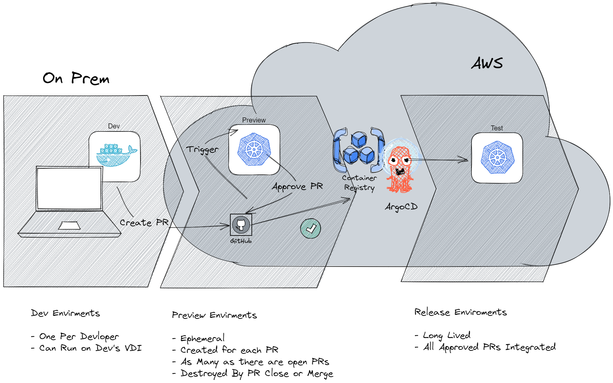

# EngX Approach

## Optimize for Cycle Time

Our key metric and north star is cycle time, as this is a aggregate measure of
flow efficiency and a leading metric for value delivery.

## Lifecycle

## DX

Good developer experience and fast feedback looks are critical for minimizing
waiting time, while also decreasing frustration, which increases processing
them. It should be easy for developers to set up there working environmnet, to
see their code and tests running in a producion-like envivornment, to share
their work for testing and review.

To accomplish this, we will automate the deployment of the application
leveraging kubernetes namespaces to create production-like enviroments across
the delivery pipeline, including on the developers desktop (VDI), using
Kubernetes via Docker Desktop.

For the first sprint we will use docker compose with docker desktop for local
enviroments as we author the autmation to use kuberenetes namespaces.

#### Risk

Maybe obstacles in getting this working on the VDI, including client policy and
aproval delays.

##### Mitigation:

Try it as soon as possible.

##### Alternative

Allow developers to deploy their own working namescapes on the hosted
kubernetes cluster, or use Cloud9 hosted dev environments with customer's AWS

## QA

The DX approach described above will also have a benifit of increasing QA
efficiency by allowing a degree of testing to be shifted left and run in the
developers own workspaces before code is even pushed to github, meaning that
defects are discovered earlier in the process and thus resolved with less cost,
effort, amd time lost, and reducing "works on my machine" issues.

In order to further maximize QA efficiency, we want to leverage the automation
created for DX to deploy ephemerial preview enviroment for code review and
testing, this reduces wait time for QAs by allowing us to spin up an
environment for each pull request, thus eliminating contention for QA
environments. By using ephemerial preview enviroments instead of long lived
shared enviroments, we also increase the reliability of test results by
eliminating configuration drift and state build up.

## SCM

Source Countrol will be in GitHub

The main application (webapp) will be in a [Monorepo](https://monorepo.tools), this will include:
 - Main UI
 - Applications features, i.e. Login, Alarms, etc
 - Insight Microfrontends
 - Design Component Packages

We will use [Trunk Based Development](https://trunkbaseddevelopment.com) with
[Short Lived FeatureBranches](https://trunkbaseddevelopment.com/short-lived-feature-branches/).

Branches should be branched directly off main and come back as pull requests into the main/trunk.

## Git Commit Message Policy

We will follow the [Conventional Commits](https://www.conventionalcommits.org/en/v1.0.0/#summary) format, in summary

- Keep it concise: Limit your commit messages to 50 characters or less.
- Start the commit message with a type prefix that categorizes the nature of
the change.
  - feat: A new feature or enhancement added to the project.
  - fix: A bug fix or correction made to the project.
  - docs: Documentation-related changes, such as updating README files or
    adding comments.
  - style: Changes that do not affect the code's functionality (e.g.,
    formatting, indentation).
  - refactor: Code refactoring or restructuring without adding new features or
    fixing bugs.
  - test: Adding or modifying tests.
  - chore: Routine tasks, maintenance, or other non-code-related changes.
- Use present tense. eg. "update registration form" rather than "Feat: Updated
  registration form."
- Commit message with ! to draw attention to breaking change. eg "feat!:
  update registration form"
- Explain breaking change with a BREAKING CHANGE footer.
  eg: BREAKING CHANGE: Replace Name field with First Name and Last Name field
- Reference ADO stories that relate to this change.

## SemVer

We will use [Semantic Versioning](https://semver.org/) for each component.

- Version format: Follow the MAJOR.MINOR.PATCH format for version numbers.
- MAJOR version: Increment the MAJOR version when you make incompatible API
  changes or introduce significant new features.
- MINOR version: Increment the MINOR version when you add functionality in a
  backward-compatible manner.
- PATCH version: Increment the PATCH version for backward-compatible bug fixes
  or minor improvements.

## Commit Messages and SemVer

Fix type commits should be translated to PATCH releases. feat type commits
should be translated to MINOR releases. Commits with BREAKING CHANGE in the
commits, regardless of type, should be translated to MAJOR releases.

## Tools

- [commitzen](https://commitizen-tools.github.io/commitizen/) is a tool that
  help write commit messages and manage semver version bumping.

